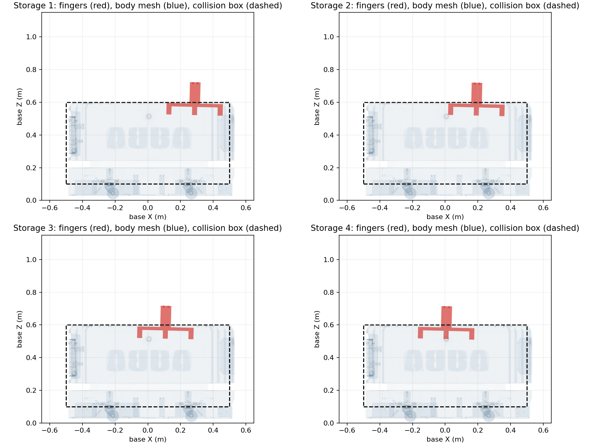

# 存储位碰撞原因核查（2026-09-10）

四个原存储位都存在夹指与底盘详细可视三角网格相交。离线 FCL 检测确认了 MoveIt 报告的干涉，且夹爪张开、闭合两种状态都成立。

## 根因

学生目标指定的是腕部 `wrist3_Link`，不是夹指尖端。当前工具在这些姿态下向腕部下方延伸约 298 mm；腕部距底盘顶面只有约 207–215 mm，导致夹指进入底盘。

| 存储位 | 张开时夹指最低 Z（车体坐标） | 低于 0.60 m 顶面 | 详细底盘网格相交 |
|---|---:|---:|---|
| 存储位 1 | 0.5175 m | 82.5 mm | 两根夹指均相交 |
| 存储位 2 | 0.5146 m | 85.4 mm | 两根夹指均相交 |
| 存储位 3 | 0.5119 m | 88.1 mm | 两根夹指均相交 |
| 存储位 4 | 0.5095 m | 90.5 mm | 两根夹指均相交 |

“低于顶面”是 Z 方向高度差，不是 FCL 的最小分离距离。



红色为夹指详细网格，蓝色为底盘详细网格，虚线为 MoveIt 底盘碰撞盒。图为 XZ 投影；相交结论来自三维 FCL 检测，未仅凭投影判断。

## 排除项

- URDF 与 USD 的两根夹指可视/碰撞网格包围范围一致，最大边界差低于 1e-12 m。
- 夹指 STL 尺寸约 344 × 59.7 × 200 mm，两端使用相同文件；底盘 STL 缩放为 0.1，URDF 与 USD 坐标一致。
- 底盘盒体顶面 0.600 m，详细可视模型最高点约 0.59865 m；详细三角网格检测同样相交。
- 本地和远程夹指、底盘、电机、转接件 STL 的 SHA-256 一致，结果文件记录了所用版本。
- 上一轮已验证关节角与学生笛卡尔目标一致，因此没有调整角度单位或基座坐标。

底盘可视 STL 并非完整封闭体。本次使用的是三角面相交检测，所有原目标均检测到实际三角面相交；不依赖封闭体内部判定。

## 可行调整候选（未执行）

保持原 XYZ 中的 X/Y 和四元数，仅沿机械臂基座 Z 抬高目标：

| 调整 | 四个点 IK | 张开/闭合碰撞检查 | 从本次当前状态规划 |
|---|---|---|---|
| +0.10 m | 全通过 | 全通过 | 全通过 |
| +0.12 m | 全通过 | 全通过 | 全通过 |

按原夹指的最低 Z 估算，+0.10 m 后距盒体顶面仅约 9–17 mm，+0.12 m 后约 29–37 mm。
这些是只读诊断候选，不是已经执行验收的新工作位。提高腕部目标也会提高抓取/放置高度，必须同步考虑放置面和工件位置。
原始目标、用户快捷位、URDF、USD、碰撞禁用列表均未改动。没有执行任何新候选运动。

## 另外发现的模型精度问题

转接件和电机使用了偏小的简化碰撞体：

- 转接件网格约 284 × 160 × 17 mm，碰撞盒只有 100 × 100 × 50 mm。
- 电机网格局部 Z 范围约 -116～417 mm，碰撞圆柱 Z 范围仅 -70～70 mm。

这些不足会造成漏检，不能解释本次已经确认的夹指碰撞。后续若要把模型用于完整抓取验证，需单独校正工具碰撞体，并重新验证所有目标与路径。

## 复现与记录

- [详细几何检测数据](test/results/storage_geometry_audit_20260910.json)
- [抬高目标的 IK/规划数据](test/results/storage_lift_candidates_20260910.json)
- `test/audit_storage_geometry.py`：离线 URDF FK、USD 网格边界核对、FCL 三角网格相交和示意图；依赖 numpy、scipy、trimesh、python-fcl、matplotlib、pxr。
- `test/check_storage_lift.py`：仅调用 MoveIt IK、状态有效性、规划服务，无执行客户端。

在仓库根目录、具有上述依赖的 Python 环境运行几何核查：

```bash
python aubo_control_gui/test/audit_storage_geometry.py --repo . --output /tmp/storage-audit
```

## 为什么实时 RViz 看起来没有碰撞

核查时，实时 `/joint_states` 的六个关节均接近 0°，与四个存储位的最大单关节差为约 150–160°。
原存储位规划被拒绝后没有执行，上一轮测试也已返回起始姿态，因此实时模型处于另一姿态。
碰撞结论针对原存储位目标，并不是说当前停放姿态正在碰撞。

新增独立 RViz 诊断窗口，只发布 MarkerArray 和调用 FK/碰撞检查服务，不发布运动命令：

```bash
ros2 launch aubo_control_gui collision_review.launch.py target_name:="存储位 1"
```

红色是目标夹指，半透明蓝色是底盘，黄色球是 MoveIt 返回的接触位置。
工具栏默认选中 `Move Camera`，在三维区域按住鼠标左键拖动可绕目标旋转；中键拖动平移，滚轮缩放。
误切到选择工具时，重新点击 `Move Camera`。`Views` 面板使用 `Orbit`，也可以直接调整 Pitch、Yaw 和 Distance。
窗口标注 `target only` / `NOT EXECUTED`。这不是实时实体机器人，也不会改变当前关节状态。
可在同一窗口切换目标：

```bash
ros2 param set /student_target_collision_display target_name "存储位 2"
ros2 param set /student_target_collision_display target_name "存储位 3"
ros2 param set /student_target_collision_display target_name "存储位 4"
```

运行前沿用本项目的 ROS 环境、工作空间、`ROS_DOMAIN_ID=133` 和本机发现设置。
也可在现有 RViz 添加 MarkerArray，订阅 `/diagnostics/student_target`（Reliable / Transient Local）。

[存储位 1 的 RViz 目标诊断渲染](test/results/rviz_storage_target.png)
