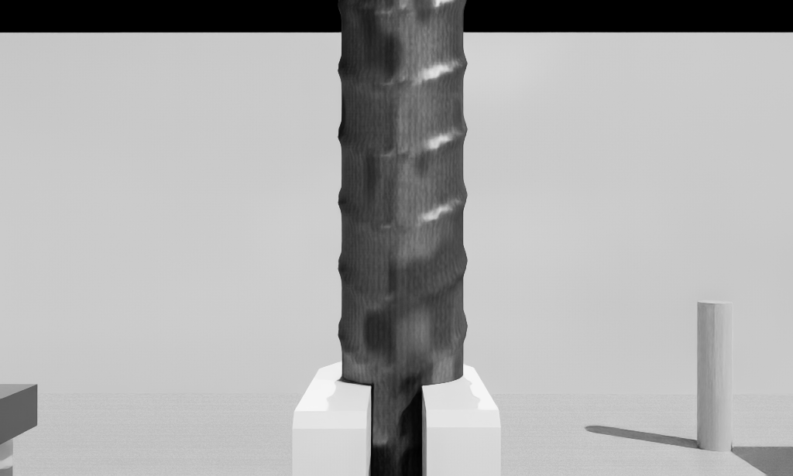
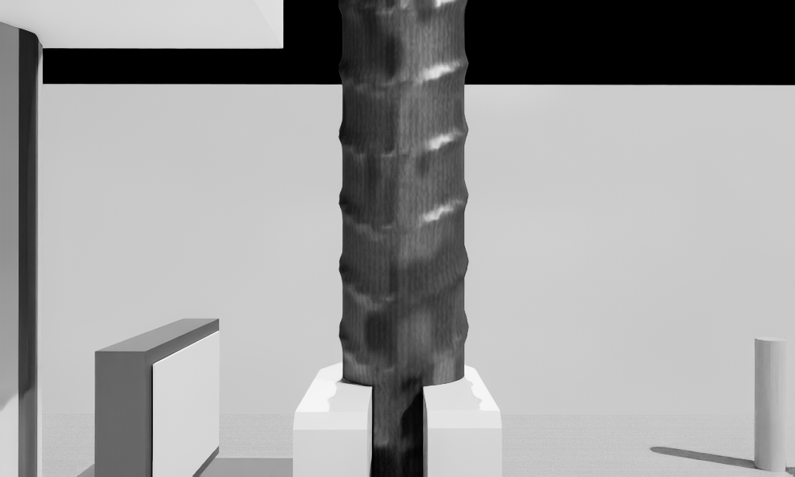
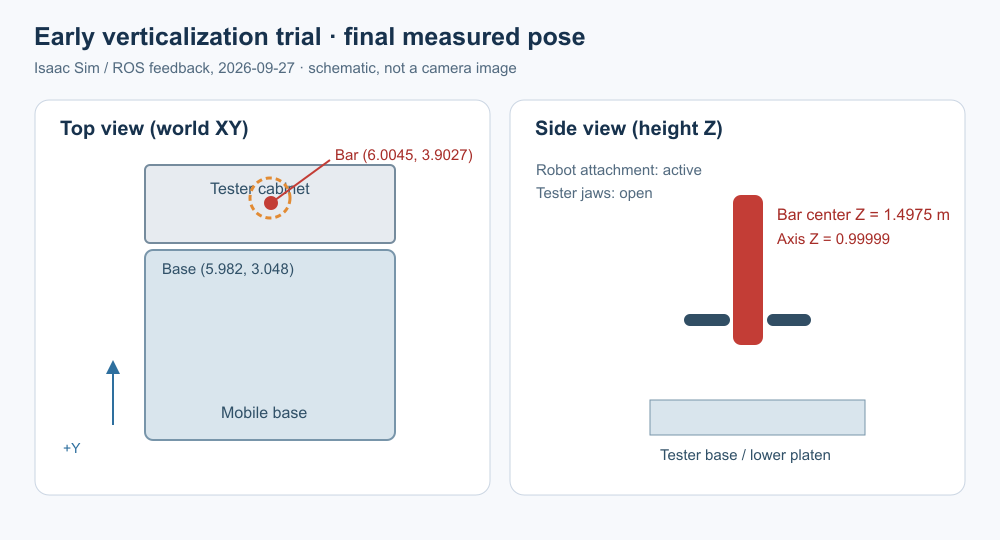

# 提前竖直化钢筋，再驱动底盘靠近拉伸测试机

本实验解决车载钢筋流程中最后一段大幅关节预定位偶发无逆解的问题。
机械臂在测试机外的开阔点 `(6.0, 2.6)` m，从车载第 1 槽取筋、竖直化、
进入预插入关节姿态；底盘保持这一姿态低速倒车到 `(6.0, 3.05)` m；
停车后末端分两段短距离移动至夹持线。第 7 段结束时机器人仍保持钢筋，
测试机抱爪保持张开。交接动作等待单独指令。

## 节点与运行方法

启动 [实验室场景](README_REBAR_ONBOARD_TRANSPORT.md#启动)，另开 Ubuntu
终端执行：

```bash
source /opt/ros/lyrical/setup.bash
source ~/Develop/ROS_ws/hongshi_mm_ws/install/setup.bash
export ROS_DOMAIN_ID=133

# 1. 起点取筋、放入车载第 1 槽
ros2 run seer_description test_rebar_grasp.py \
  --onboard-slot 1 --output /tmp/rebar_early_01.json

# 2. 载筋至开阔转向点，停放并锁定底盘
ros2 run seer_description 02_navigate_standoff.py \
  --onboard-slot 1 --output /tmp/rebar_early_02.json

# 3. 从车载槽重新夹取
ros2 run seer_description pickup_onboard.py \
  --onboard-slot 1 --at-standoff \
  --state-file /tmp/rebar_early_state.json --output /tmp/rebar_early_03.json

# 4. 在开阔点将钢筋竖直化
ros2 run seer_description 03_verticalize_standoff.py \
  --state-file /tmp/rebar_early_state.json \
  --output /tmp/rebar_early_04_verticalize.json

# 5. 在开阔点预先设好接近测试机的关节姿态
ros2 run seer_description 04_preposition_standoff.py \
  --state-file /tmp/rebar_early_state.json \
  --output /tmp/rebar_early_05_preposition.json

# 6. 保持竖直持筋姿态，低速驶到测试机停靠点
ros2 run seer_description 05_drive_vertical_rebar.py \
  --state-file /tmp/rebar_early_state.json \
  --output /tmp/rebar_early_06_drive.json

# 7. 停车后末端作两段短距离微调，到夹持线即停止
ros2 run seer_description 06_micro_insert.py \
  --state-file /tmp/rebar_early_state.json \
  --output /tmp/rebar_early_07_micro.json
```

每段退出码为 0 才运行下一段。所有节点共享状态文件，场景重启后从第 1 段
重新开始。第 2 段沿原绕行路线到 `(6.0, 2.6)` m，之后不继续驶向机器。
第 3 段复用车载取筋节点的 `--at-standoff` 模式。第 5 段使用在本场景实测
过的关节候选，但**先以 FK 验证末端目标，再经 MoveIt 碰撞检查规划**；
不满足验证则停止。第 6 段速度上限 `0.08 m/s`，循环监测钢筋相对车体
的位置与轴线、底盘横向误差和朝向，异常时停车。第 7 段不调用旧的
`onboard_preposition` 逆解，直接从第 5 段已完成的姿态作两次短距离
笛卡尔移动，并验证夹持线位置。

导航目前基于 `/cmd_vel` 和里程计闭环，未接入 Nav2。竖直钢筋行驶的
通行空间按当前实验室场景验证；更改货架、设备或路线后须重新检查。

## Ubuntu / Isaac Sim 实测（2026-09-27）

从新启动的场景按上述 7 段依次执行，**共 92 项检查通过、0 失败**：

| 段 | 结果 | 报告 |
|---|---|---|
| 1 装车 | 钢筋稳定落在车载第 1 槽 | [JSON](test/results/rebar_early_01.json) |
| 2 到开阔点 | 停在 `(5.983, 2.603)` m，钢筋仍在槽内 | [JSON](test/results/rebar_early_02.json) |
| 3 车载取筋 | 脱离托座并抬高，机器人建立抓取约束 | [JSON](test/results/rebar_early_03.json) |
| 4 竖直化 | 钢筋轴线 Z 分量约 `1.0`，夹持位置偏差约 `5 mm` | [JSON](test/results/rebar_early_04_verticalize.json) |
| 5 提前预定位 | 碰撞检查轨迹 71 点，执行后钢筋车体系约 `(-0.567, 0.007, 1.499)` m | [JSON](test/results/rebar_early_05_preposition.json) |
| 6 竖直持筋行驶 | 底盘至 `(5.982, 3.042)` m；沿途钢筋相对车体偏差约 `7 mm` | [JSON](test/results/rebar_early_06_drive.json) |
| 7 末端微调 | 两段笛卡尔轨迹均完成，钢筋中心世界坐标约 `(6.005, 3.903, 1.498)` m，轴线 Z 分量 `0.99999` | [JSON](test/results/rebar_early_07_micro.json) |

到位后再静置 3 秒，钢筋中心位移约 `0.0025 mm`，底盘锁定，机器人仍持筋，
测试机未夹持；见 [稳定性数据](test/results/rebar_early_final_stability_20260927.json)。





终点时腕部相机被测试机近处结构遮挡。下图根据本轮 ROS/Isaac 实测坐标
绘制，是位置示意图，不是相机截图：



这是一轮成功的完整场景实验；尚需多轮重跑来评估规划与物理仿真的
重复性。下一步是测试机抱爪接管和机器人松爪，当前节点没有执行这些动作。
