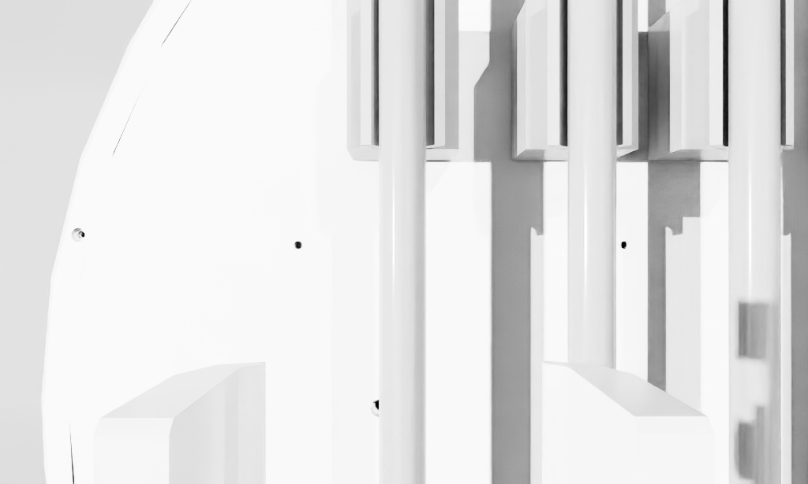

# 钢筋抓取、转向和车载装载（Isaac Sim + MoveIt 2）

在 Isaac Sim 仓库场景中加入钢筋工位，用 finger 双指夹爪完成
**接近 → 下探 → 夹取 → 提起 → 搬运 → 释放** 的全流程自动化测试。
2026-09-16 在 Ubuntu 26.04 / ROS 2 Lyrical / Isaac Sim 6.x 上全流程验证通过
（13 项检查全部 pass，报告见 `test/results/rebar_grasp_20260916.json`）。

## 场景组成

钢筋工位由 `generate_rebar_station.py` 生成（`urdf/rebar_station.usda`）：

- 工位位于机械臂臂展内（默认 x = -1.15 m，机械臂底座朝 -X 方向）
- 工位台（0.9 × 0.5 × 0.45 m，静态碰撞体）
- 两个**低摩擦**（friction 0.05）弧形托座：随钢筋长度放在中心两侧 30% 处，
  内半径 16 mm、开口弧度 140°，用 14 段独立碰撞盒保留凹槽，限制横向滚动，
  被夹起时可竖直脱出
- **钢筋**：动态刚体圆柱，24 mm 直径 × 0.6 m 长，密度保持 7850 kg/m³，
  质量约 2.13 kg，锈色，高摩擦表面（0.8）

演示场景使用独立 wrapper 层叠；钢筋工位层更新为弧形托座，既有机器人资产保持不变：

| 场景文件 | 夹爪 | 说明 |
|---|---|---|
| `warehouse_finger_rebar_loading_prefilled_demo.usda` | finger 双指 | 2/3/4 槽已有动态钢筋，测试放入第 1 槽 |
| `warehouse_finger_rebar_loading_demo.usda` | finger 双指 | **车载装载**：四个弧形料槽，钢筋从 X 向转为 Y 向 |
| `warehouse_finger_rebar_mono_demo.usda` | finger 双指 | **推荐**，可夹钢筋 |
| `warehouse_stick_rebar_mono_demo.usda` | stick 板式 | 仅场景预留，闭合间隙 50 mm，夹不住钢筋 |

> stick 夹爪两指为上下板式结构，全闭仍有约 50 mm 间隙，只适合 50–130 mm
> 厚的物体；钢筋测试必须使用 finger 变体。

## 启动

```bash
source /opt/ros/lyrical/setup.bash
colcon build --symlink-install --packages-up-to seer_description seer_aubo_finger_mono_moveit_config
source install/setup.bash

# 车载装载场景（Isaac + RViz + MoveIt 工位/料槽碰撞几何）：
ros2 run seer_description start_warehouse_finger_rebar_loading_demo.sh --gui --domain-id 133
# 原工作台抓取/释放演示：
ros2 run seer_description start_warehouse_finger_rebar_mono_demo.sh --gui --domain-id 133
# 无头验证：
ros2 run seer_description start_warehouse_finger_rebar_mono_demo.sh --no-rviz --domain-id 133
```

启动脚本继承 `start_isaac_ros2_stack.sh` 的全部参数
（`--ros-bridge-mode`、`--renderer` 等），lyrical 主机自动使用 internal bridge。

## 运行测试

```bash
# 在车载装载场景中，抓取后转向 90° 放入指定料槽（1–4）：
export ROS_DOMAIN_ID=133
ros2 run seer_description test_rebar_grasp.py --onboard-slot 1 --output /tmp/rebar_loading.json

# 在原工位场景中完成抓取/释放测试，退出码 0 = 全部通过
ros2 run seer_description test_rebar_grasp.py --output /tmp/rebar.json

# 仅检查抓取接近和下探规划，不执行，不覆盖带载装载路径
ros2 run seer_description test_rebar_grasp.py --plan-only
```

测试流程与判定：

| 步骤 | 判定 |
|---|---|
| 张开夹爪 | 手指回到 0 ± 1.5 mm |
| TCP 标定 | FK 计算夹爪 TCP 相对 wrist3 偏移（finger 版为 (0, 0, 0.16)） |
| 预抓取 IK | 多种子 KDL IK + 角度解绕回 + 前向分支代价惩罚 |
| 接近 / 下探 / 提起 / 搬运 | OMPL 关节规划 + 笛卡尔直线路径，经 `/execute_trajectory` 执行 |
| 夹取判定 | 两指先移动至少 3 mm，再在到达指令行程前**停滞**；最终闭合目标继续提供预紧力 |
| 提起判定 | `world -> rebar` 的实际 Z 位移至少达到指令值的 60% |
| 保持判定 | 提起后两指仍保持接触位置 |
| 搬运判定 | 钢筋实际 XY 位移至少达到指令值的 60% |
| 释放判定 | 两指回到 0 ± 1.5 mm，且钢筋实际下降超过 3 cm |

常用参数：`--rebar-x/-y/-z`（钢筋位置）、`--diameter`、`--close-position`、
`--approach-height`、`--lift-height`、`--release-dy`、`--tcp-y/--tcp-z`。

规划走 move_group 服务（OMPL + 笛卡尔路径），执行经
`/aubo_arm_controller/follow_joint_trajectory`（action_bridge）与
`/execute_trajectory`，与 RViz 的 Plan & Execute 同一条链路，不依赖 MoveItPy。
Isaac runner 额外发布动态 `world -> rebar` TF，测试不会再以“夹指停住”代替
钢筋实际运动。action bridge 允许关节集合互不重叠的轨迹并行；夹爪接触目标完成后
保留最终闭合驱动目标，机械臂运动期间仍有夹持预紧力。

## 静态校验

```bash
~/isaacsim/.venv/bin/python test/test_rebar_station_usd.py   # 需 USD (pxr) 环境
```

校验钢筋的刚体/质量/碰撞 API、托座凹槽、车载料槽所属刚体、低摩擦材质和 wrapper 层叠完整性。
若使用 `~/isaacsim/python.sh` 且未直接提供 pxr，会先初始化无头 `SimulationApp`，冷启动较慢。

## 重新生成场景

```bash
ros2 run seer_description generate_rebar_station.py \
  [--station-x -1.15] [--radius 0.012] [--length 0.6] [--table-height 0.45]
```

## 已知事实（实测）

- finger 夹爪指面开口实测 ≈ 0.0464 m（非碰撞盒推算值）；夹 24 mm 钢筋时
  手指停在约 0.015 / 0.019 m，呈 V 形边缘夹持、两侧不完全对称，属正常现象。
- 抓取姿态：wrist Z 竖直向下，wrist X（闭合轴）水平横切钢筋（默认 `--wrist-x-axis y`）。
- 默认搬运沿 Y 方向 0.18 m，使释放后的钢筋落回工作台；可用 `--release-dy` 调整。
- 释放后钢筋会掉落滚动，**重复测试前需重启仿真**以复位钢筋位置。
- `start_isaac_ros2_stack.sh` 的就绪等待为 300 s：Isaac 冷启动可达 135 s 以上。

本次远程实测：钢筋抬升 0.1786 m、水平搬运 0.1767 m、释放下降 0.2384 m；
夹指释放后位置为 0.7 / 1.0 mm。完整数值保存在上述 JSON 报告中。

## 车载装载流程

新增 `rebar_onboard_rack.usda` 为四个料槽，每槽在 Y=±0.19 m 设两个弧形托座，中央留给夹爪。托座内半径 17 mm、开口 140°；钢筋最终中心高度约 0.670 m。料槽是 `base_link` 刚体下的碰撞子几何，跟随车体运动，不是悬空的世界固定物体。

| 料槽 | 中心 X / m | 中心 Y / m | 钢筋轴向 |
|---|---|---|---|
| 1 | 0.2927 | 0 | Y |
| 2 | 0.1969 | 0 | Y |
| 3 | 0.1138 | 0 | Y |
| 4 | 0.0118 | 0 | Y |

以上坐标在 `base_footprint` 下，与原四个存储位的腕部投影对应。装载目标采用重新标定的抓取 TCP 和水平钢筋姿态；不会改写学生原始关节角。原四个存储位空夹爪复测见[关键位置报告](../aubo_control_gui/KEY_POSITION_VALIDATION.md)。

抓取和提起后，MoveIt 将 0.6 m 钢筋作为夹爪上的 attached collision object；继续升高，绕竖直方向旋转 90°，保持腕部向下、钢筋水平，以三段笛卡尔路径从车体侧面绕行转移，在料槽上方缓慢下探至钢筋中心比座面高 50 mm，松开让钢筋落入托座，再撤回夹爪。所有路径启用碰撞检查。带载规划使用半径 20 mm、长度 0.62 m 的保守包络（实际钢筋尺寸及密度保持不变）。每 0.25 s 比较实际钢筋中心与夹爪 TCP；偏差超过 40 mm 持续 0.35 s 即取消机械臂执行，丢失坐标反馈超过 1 s 也会停止。各段结束额外检查钢筋实际跟随误差小于 25 mm。`--clearance-height` 默认 0.90 m；工位远端升到 0.98 m 会接近当前姿态的可达边界，已调低避开。成功判断使用钢筋实际 TF：落点、Y 轴方向、夹指张开和释放后的稳定性，均相对动态车体反馈计算。

`rebar_loading_scene.py` 将工位及同参数车载托座加入 MoveIt。车载托座附着在 `base_link`；释放后将钢筋的实测落位作为车体上的 attached collision object 加入碰撞场景，撤回时继续避碰。`world → odom` 为 Isaac 原点的恒等变换，连接工位与机器人 TF。完整仓库环境仍未全部导入 MoveIt。

基础物理场景只有一根待抓钢筋和四个独立料槽；另有三根预装钢筋的场景，可验证相邻槽已占用时的装载。自动补料与连续多根抓取尚未实现。每次独立装载测试前重启该场景，复位钢筋和规划场景。

预装 2/3/4 槽、再将待抓钢筋放入 1 槽：

```bash
MODEL_DIR="$PWD/src/AuboAMR300_ROS2/seer_description/urdf"
ros2 run seer_description start_warehouse_finger_rebar_loading_demo.sh \
  --usd "$MODEL_DIR/warehouse_finger_rebar_loading_prefilled_demo.usda" \
  --occupied-slots 2,3,4 --gui --domain-id 133
# 另一个终端：
export ROS_DOMAIN_ID=133
ros2 run seer_description test_rebar_grasp.py --onboard-slot 1 \
  --occupied-slots 2,3,4 --output /tmp/rebar_loading_prefilled.json
```

预装钢筋仍是独立动态刚体，使用相同尺寸、密度和材料，依靠托座承载；MoveIt 也加载它们的碰撞几何。测试除了新钢筋落位，还核查其余三根仍在各自槽内。释放高度留出相邻钢筋与张开夹指之间的垂直间隙。

## 末端相机图像

MV-CH100-60UM + 12 mm 镜头的模拟黑白图像由 `/camera/image_raw` 发布，预览分辨率 1024×615、编码 `mono8`，不是实机 10 MP 原始采集。另一个同 ROS 环境终端运行：

```bash
export ROS_DOMAIN_ID=133
ros2 run seer_description camera_video.py --ros-args \
  -p host:=0.0.0.0 -p image_topic:=/camera/image_raw
```

macOS 浏览器打开 [实时视频](http://192.168.3.133:8080/)，或[单张图像](http://192.168.3.133:8080/snapshot.jpg)。服务在图像过期时返回 503，避免把旧帧显示为实时图像。图像跟随机械臂姿态变化；更多参数见[相机文档](README_MONO_CAMERA.md)。

### 调试记录：搬运时钢筋碰臂掉落

初版使用无末端姿态约束的 OMPL 关节转移，规划/机械臂执行成功，但钢筋实际掉到地面，用户也观察到了碰臂。该次装载判定失败。当前机械臂 MoveIt 碰撞模型使用简化圆柱/球体，不能仅凭规划成功认定物理搬运成功。已改为水平钢筋、腕部向下的侧面分段笛卡尔路径，增加带载保守碰撞包络与途中实际物体跟随监测；不关闭钢筋与机械臂的物理碰撞，不用固定关节或瞬移绑定钢筋。

搬运前使用已通过侧向路径的正 J3 肘部解；另一肘部解虽然能到抓取位，却不能完成当前侧向路径，已排除于本装载流程。这个选择只用于钢筋自动测试，不修改 GUI 通用 IK、机械臂限位或学生原始位置。

## 2026-09-16 车载实测结果

四个料槽分别从复位场景完成实际抓取、90° 转向、侧面搬运、下探、释放和撤回，各 24 项检查全部通过（空槽独立测试）。使用最终 0.90 m 搬运高度、座面上方 50 mm 释放高度；初始托座静置 10 s 未测得滚动。

| 料槽 | 释放后钢筋中心 Z / m | 撤回后 3 s 位移 / mm | 报告 |
|---|---|---|---|
| 1 | 0.67021 | 0.293 | [JSON](test/results/rebar_loading_slot1_20260916.json) |
| 2 | 0.67000 | 0.016 | [JSON](test/results/rebar_loading_slot2_20260916.json) |
| 3 | 0.67012 | 0.045 | [JSON](test/results/rebar_loading_slot3_20260916.json) |
| 4 | 0.67001 | 0.172 | [JSON](test/results/rebar_loading_slot4_20260916.json) |

[旧无姿态约束路径掉落的失败记录](test/results/rebar_loading_unconstrained_failure_20260916.json)保留用于对比。另已验证[仅规划模式](test/results/rebar_loading_plan_only_20260916.json)：不发送机械臂或夹爪运动目标；旧版该模式仍会先张开夹爪，已修正。

当前程序增加启动前碰撞场景检查：工位、料槽或指定已占用槽的碰撞对象缺失时，不开始运动。此检查已在预装场景验证；空槽四份报告是在加入该额外检查之前采集，实际路径参数一致。

三槽预装后放入第四根的[完整验证](test/results/rebar_loading_prefilled_20260916.json)共 26 项，全部通过。新钢筋释放后中心高度 0.66999 m、撤回后三秒位移 0.038 mm；其余三根仍在对应槽内，中心高度均约 0.67000 m。四根均由托座自然承载。

[相机实测](test/results/rebar_loading_camera_20260916.json)在 10 s 内收到 38 帧 1024×615 `mono8`，画面标准差 36.51，未发布伪深度。下面是末端相机原始黑白截图，保留当前模型安装外参，没有调整颜色以匹配 Isaac 主视窗：



USD 静态校验 7 项通过，包含凹槽保持凹形、料槽归属底盘刚体和三根预装钢筋独立刚体/质量。
