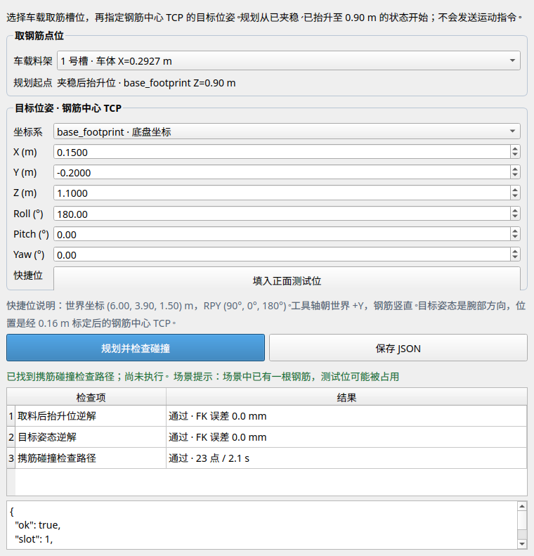

# 钢筋末端姿态规划 GUI

此小程序选择车载料架的 1–4 号槽，输入钢筋中心 TCP 的目标位置 XYZ 和姿态
Roll/Pitch/Yaw，然后向当前 Ubuntu MoveIt 请求逆解与携筋碰撞检查路径。
**它只规划，不发送机械臂、夹爪或底盘运动命令。**

规划起点是钢筋已夹稳、抬升至车体坐标 `Z=0.90 m` 后的腕部姿态。
夹爪单指位置按本轮实际抓筋反馈设为约 `0.017 m`，不使用当前松爪反馈。
槽位中心的车体 X 坐标依次为 `0.2927 / 0.1969 / 0.1138 / 0.0118 m`。
目标位置为**钢筋中心 TCP**，不是腕部法兰；程序按已标定的末端
`(0, 0, 0.16) m` 偏移换算腕部目标。目标姿态仍是腕部姿态。

默认快捷位为测试机正面：世界坐标 `(6.00, 3.90, 1.50) m`，
RPY `(90°, 0°, 180°)`。在当前底盘停靠方向下，工具轴朝世界 +Y，
钢筋轴竖直。可以改为任意目标，也可以把坐标系切换为
`base_footprint`。

## 启动

先按[实验室流程](README_REBAR_EARLY_VERTICAL_APPROACH.md)启动 Isaac Sim、
ROS 2 和 MoveIt。Ubuntu 图形桌面中打开第二个终端：

```bash
source /opt/ros/lyrical/setup.bash
source ~/Develop/ROS_ws/hongshi_mm_ws/install/setup.bash
export ROS_DOMAIN_ID=133
ros2 run seer_description rebar_pose_planner_gui.py
```

需要 Ubuntu 的 PySide6 QtWidgets 模块（缺失时安装
`python3-pyside6.qtwidgets`）。窗口中选槽位、填写位姿，点击“规划并检查碰撞”；结果会列出
取料后抬升姿态的 IK、目标 IK、携带钢筋圆柱碰撞体的关节路径及轨迹点数。
“保存 JSON”保存该次报告。规划场景须有车载料架碰撞体；测试机碰撞体
缺失时程序按现有设备尺寸补入 MoveIt 场景。界面不会把规划轨迹送去执行。

没有桌面时可使用相同后端：

```bash
ros2 run seer_description rebar_pose_planner_backend.py \
  --slot 1 --frame world \
  --x 6.00 --y 3.90 --z 1.50 \
  --roll 90 --pitch 0 --yaw 180 \
  --output /tmp/rebar_pose_slot1.json
```

退出码 0 表示找到携筋碰撞检查路径；退出码 1 和报告中的 `stage`、`error`
说明停止位置。逆解通过并不等于轨迹通过，二者分开显示。

## 规划边界

- 料槽编号提供几何取筋位；程序不会确认所选槽当前是否真的有钢筋。
- 虚拟钢筋以长 `0.62 m`、半径 `0.020 m` 的圆柱附着在夹爪上，
  用于运输路径碰撞检查。
- 从车载料槽接触钢筋、脱离托座，以及底盘导航由现有分阶段脚本负责。
  本程序的轨迹从完成夹取并抬升之后开始，不包含这些动作。
- 结果依赖当前底盘 TF、MoveIt 场景和设备布局。底盘或设备移动后应重新规划。
- 此工具不提供轨迹执行按钮；执行仍应通过经过现场检查的分阶段流程。

## Ubuntu 仿真验证（2026-09-27）

在当前 Isaac / MoveIt 场景中，以底盘坐标目标
`(0.15, -0.20, 1.10) m`、RPY `(180°, 0°, 0°)` 逐一规划，
四个槽位均得到携筋碰撞检查轨迹：[1 号](test/results/rebar_pose_planner_slot1_20260927.json)、
[2 号](test/results/rebar_pose_planner_slot2_20260927.json)、
[3 号](test/results/rebar_pose_planner_slot3_20260927.json)、
[4 号](test/results/rebar_pose_planner_slot4_20260927.json)。
窗口通过无屏幕 Qt 测试，实际点击规划也返回成功结果。

当前测试机已有一根钢筋。将目标设为默认测试位时，碰撞检查拒绝第二根
钢筋进入该位置，报告为[目标逆解未通过](test/results/rebar_pose_planner_occupied_tester_20260927.json)。
这反映的是本轮已占用的规划场景；清空测试位后需重新规划。


